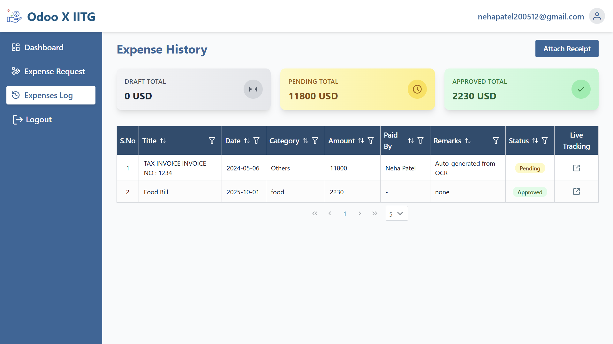

# Expense Management System

A modern **Expense Management System** designed to simplify expense reimbursement processes for
companies. This system reduces manual effort, improves transparency, and supports multi-level,
conditional approvals.

---

## Table of Contents

-   [Features](#features)
-   [User Roles & Permissions](#user-roles--permissions)
-   [Approval Workflow](#approval-workflow)
-   [Conditional Approval Flow](#conditional-approval-flow)
-   [OCR Integration](#ocr-integration)
-   [APIs Used](#apis-used)
-   [Tech Stack](#tech-stack)
-   [Setup & Installation](#setup--installation)
-   [Usage](#usage)
-   [Screenshots / Mockups](#screenshots--mockups)
-   [License](#license)

---

## Features

-   **Authentication & User Management**

    -   Auto-create company and admin on first signup
    -   Create Employees & Managers
    -   Assign and change roles: Employee, Manager
    -   Define manager relationships for employees

-   **Expense Submission (Employee Role)**

    -   Submit expense claims with: Amount (different currencies supported), Category, Description,
        Date
    -   View expense history (Approved, Rejected, Pending)

-   **Approval Workflow (Manager/Admin Role)**

    -   Multi-step approval process
    -   Approvers can approve/reject expenses with comments
    -   Admin can define approval sequences when multiple approvers exist
    -   Expense moves to next approver only after current approval

-   **Conditional Approval Flow**

    -   **Percentage rule**: e.g., 60% of approvers approve → Expense approved
    -   **Specific approver rule**: e.g., If CFO approves → Auto-approved
    -   **Hybrid rule**: Combines both percentage and specific approver rules
    -   Supports multiple approvers + conditional rules simultaneously

-   **Role Permissions**

    -   **Admin:** Manage users, roles, approval rules, view all expenses, override approvals
    -   **Manager:** Approve/reject expenses, view team expenses, escalate per rules
    -   **Employee:** Submit expenses, view personal expense status

-   **Additional Features**
    -   **OCR for receipts:** Auto-read receipts to extract amount, date, description, type, and
        vendor
    -   **Multi-currency support:** Uses external APIs for currency conversion

---

## OCR Integration

Employees can simply scan receipts. The system uses OCR to auto-generate expense entries with:

-   Amount
-   Date
-   Description
-   Expense lines
-   Expense type
-   Vendor / Merchant name

---

## APIs Used

-   **Country & Currency Data:**  
    `https://restcountries.com/v3.1/all?fields=name,currencies`

-   **Currency Conversion:**  
    `https://api.exchangerate-api.com/v4/latest/{BASE_CURRENCY}`

---

## Tech Stack

-   **Frontend:** React, Tailwind CSS, PrimeReact (optional)
-   **Backend:** Node.js, Express.js
-   **Database:** MongoDB
-   **OCR:** Tesseract.js (or any preferred OCR library)
-   **Other:** REST APIs for currency data & conversions

---

## Setup & Installation

1. **Clone the repository**

```bash
git clone https://github.com/your-username/expense-management.git
cd expense-management
```

### Registration:


### Login:


### Admin:

### Dashboard:


### Users:


### Add User:


### Create Approval Rules:


### Manager:

### Dashbaord:


### Approvals to Review:


### View Expense Details:


### Response to Approvals:


### Change Password in Profile:

.png>)

### Employee:


### Submit Expense:


### Expense History:



### Expense Tracking:


### Submit Expense by OCR:


